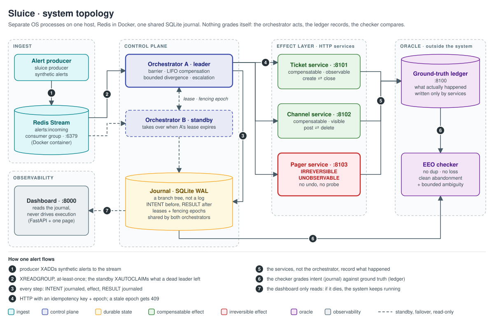
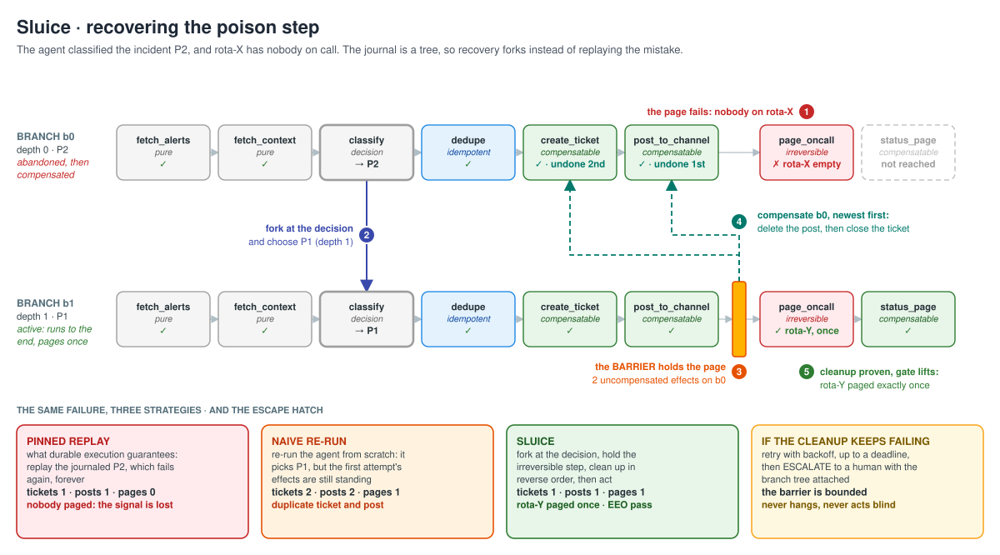
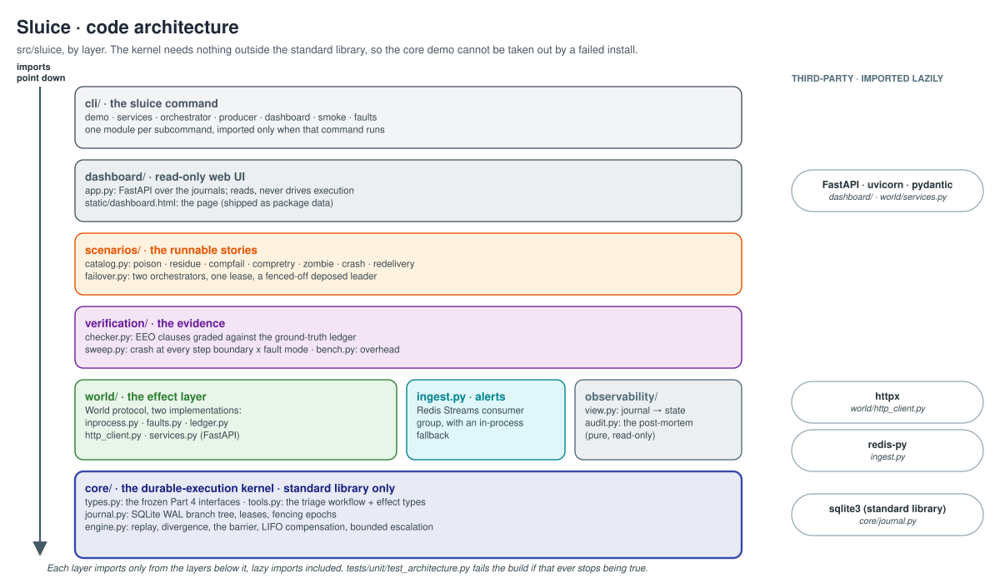

# Architecture

How Sluice is put together, and why each piece is shaped the way it is. For the
design decisions in two pages see [design.md](design.md); for commands see [cli.md](cli.md).

- [System topology](#system-topology)
- [The life of one alert](#the-life-of-one-alert)
- [Data model](#data-model)
- [The journal](#the-journal)
- [The workflow being recovered](#the-workflow-being-recovered)
- [The engine](#the-engine)
- [The effect layer](#the-effect-layer)
- [Ingest](#ingest)
- [Leases, epochs and fencing](#leases-epochs-and-fencing)
- [Verification: the oracle](#verification-the-oracle)
- [Observability](#observability)
- [Code architecture](#code-architecture)
- [Deviations from the frozen interfaces](#deviations-from-the-frozen-interfaces)
- [Reading the section numbers in the code](#reading-the-section-numbers-in-the-code)

---

## System topology

Everything runs on one host. The producer, the orchestrators, the four services and the
dashboard are separate OS processes; Redis runs in Docker; the journal is one SQLite file
shared by both orchestrators.

The property the topology exists to protect: **nothing grades itself.** The orchestrator
acts. The effect services, not the orchestrator, write what actually happened to the
ground-truth ledger. The EEO checker compares the orchestrator's journal (intent) with the
ledger (outcome). A bug that makes the orchestrator wrong about the world cannot also make
the evidence agree with it.

## The life of one alert

1. `sluice producer` `XADD`s an alert to the `alerts:incoming` stream.
2. An orchestrator reads it with `XREADGROUP` (consumer group `orchestrators`). Delivery is
   at-least-once: the alert is acknowledged only after the workflow reaches a terminal
   state, so an orchestrator that dies mid-workflow leaves it pending for another to claim.
3. The workflow id is derived from the alert id (`wf-` + sha256 prefix), so a redelivered
   alert lands on the same workflow and replays instead of re-executing.
4. The orchestrator takes the workflow's **lease** and gets a new **epoch**.
5. For each of the eight steps it writes `INTENT`, calls the effect over HTTP with an
   **idempotency key** and the epoch, and writes `RESULT`. A crash anywhere in that
   sequence is recoverable, because `INTENT` was durable before the effect was attempted.
6. When the irreversible page fails, the engine **forks**: it abandons the branch, chooses
   the highest-ranked untried classification, and runs a new branch.
7. Before the new branch may page anyone, the **barrier** requires every compensatable
   effect on every abandoned branch to be undone, newest first.
8. The page fires once. The alert is acknowledged. The checker grades the run against the
   ledger and leaves the verdict beside the journal for the dashboard.

## Data model

The interfaces in `core/types.py` were frozen early in the hackathon (Part 4 of the plan)
and every layer is written against them.

**Effect types.** Every tool carries an `EffectType`:

| Field | Values | Meaning |
|---|---|---|
| `reversibility` | `pure` · `idempotent` · `compensatable` · `irreversible` | can it be repeated, undone, or neither? |
| `observability` | `observable` · `unobservable` | can the world be asked whether it happened? |
| `externally_visible` | bool | did a human possibly see it (a channel post) |

**Results have three states, not two.** `ToolResult.status` is `ok`, `failed` or
`unknown`. A timeout is *not* a failure: the effect may have committed. Collapsing
`unknown` into `failed` is precisely the bug that produces a double page, so the type has
nowhere to put that mistake.

**Journal records.** One table, eleven kinds:

| Kind | Written when |
|---|---|
| `INTENT` / `RESULT` | before and after every effect |
| `COMP_INTENT` / `COMP_RESULT` | before and after every compensation attempt (`detail.attempt`) |
| `BRANCH_FORKED` | a new branch starts (`detail`: parent, fork point, old and new severity, depth) |
| `BRANCH_ABANDONED` | a branch is given up (`detail`: status, any irreversible residue) |
| `BRANCH_COMPENSATED` | an abandoned branch has been fully drained |
| `BARRIER_BLOCKED` / `BARRIER_RELEASED` | the gate closes before an irreversible step, and lifts (`detail`: reason and count, which the dashboard renders) |
| `ESCALATED` | a terminal hand-off to a human (`detail`: reason, branch tree, uncompensated effects, residue) |
| `LATE_DELIVERY_SUPPRESSED` | an effect surfaced as `unknown` turned out to have landed; caught on its key, not re-issued |

**Branch statuses.** `active`, `abandoned`, `compensated` (abandoned and fully drained), and
`abandoned_with_residue` (abandoned while carrying an irreversible effect that already
happened: compensation cannot remove it, so it is recorded and superseded).

## The journal

`core/journal.py`. A SQLite database in WAL mode with three tables:

| Table | Holds |
|---|---|
| `records` | every journal record: `(record_id, ts, workflow_id, branch_id, seq, kind, tool_name, effect_type, args, key, epoch, result, detail)`, indexed by workflow, by `(branch_id, seq)` and by key |
| `branches` | the tree: `(branch_id, workflow_id, parent_branch_id, fork_point_record_id, depth, status)` |
| `leases` | leadership per workflow: `(scope, owner, epoch, expires)` |

Durability choices:

- **`synchronous=FULL` by default.** Every commit is fsynced. A crash between `INTENT` and
  the effect must not lose the `INTENT`, or recovery cannot know the step was started and
  the effect commits with nothing pointing at it. `sluice demo --bench` prices this:
  on WSL2/ext4 it is ~92 % of the journal's cost. `NORMAL` and `OFF` are supported.
- **One lock around the connection.** A `Journal` may be shared by threads (the
  benchmark's workers, the dashboard's control threads). Every statement, fetch included,
  runs under one `RLock`; without it, statements interleave on the shared connection and a
  read can return another statement's row.
- **Read-only handles** (`Journal(path, read_only=True)`) open the file with `mode=ro`, so
  the dashboard cannot write to a journal even by accident.

The barrier's predicate is a query, not a data structure: `uncompensated(workflow)` returns
every `ok` compensatable `RESULT` on an abandoned branch whose key has no successful
`COMP_RESULT`. It is computed over the **whole workflow**, not the sibling branches: fork
twice and the first abandoned branch is an aunt of the active one, which a sibling check
would miss.

## The workflow being recovered

`core/tools.py` defines the incident-triage workflow: eight tools, their effect types, the
service that owns each, and a scripted agent trace. Step 3 is the agent's decision; it
carries a ranked list of alternatives.

| # | Tool | Reversibility | Observability | Service | Inverse |
|---|---|---|---|---|---|
| 1 | `fetch_alerts` | pure | observable | ticket | |
| 2 | `fetch_service_context` | pure | observable | ticket | |
| 3 | `classify` (**the decision**) | pure | observable | ticket | |
| 4 | `write_dedupe_marker` | idempotent | observable | ticket | |
| 5 | `create_ticket` | compensatable | observable | ticket | `close_ticket` |
| 6 | `post_to_channel` | compensatable, visible | observable | channel | `delete_channel_post` |
| 7 | `page_oncall` | **irreversible** | **unobservable** | pager | none |
| 8 | `update_status_page` | compensatable, visible | observable | channel | `revert_status_page` |

Severity routes the page: `P1 → rota-Y`, `P2 → rota-X`, `P3 → rota-Z`. The demo alert is
scripted to classify as P2, and the poison fault leaves rota-X with nobody on call.

## The engine

`core/engine.py`. One `Orchestrator` per attempt; `recover()` drives attempts until a
terminal outcome (`completed`, `escalated`, `not_leader`) or the attempt budget runs out
(`livelocked`).

**Three strategies, four capability flags.** The baselines are the same engine with
capabilities switched off, so the comparison isolates the idea rather than the
implementation:

| Mode | replays | diverges | barrier | compensates |
|---|---|---|---|---|
| `pinned` (what durable execution does) | yes | no | no | no |
| `naive` (start over) | no | yes | no | no |
| `sluice` | yes | yes | yes | yes |

**The step machine.** For each step: skip it if this branch already has an `ok` `RESULT`
(replay); otherwise run the barrier if the step is irreversible, write `INTENT`, execute,
resolve an `unknown`, write `RESULT`. Injectable crash points sit at four boundaries
(`before_intent`, `after_intent`, `after_effect`, `after_result`); `after_effect` is the
nastiest, since the world changed but the journal never heard, and the idempotency key is
what absorbs it on recovery.

**Divergence (bounded).** When the irreversible step fails, the engine raises an internal
`_Diverge`. Sluice abandons the branch, then forks at the decision's record, choosing
the highest-ranked alternative from *the decision's own* list that no branch has tried.
Each fork increments `depth`; at `MAX_FORK_DEPTH` (3), or when alternatives run out, it
escalates instead. Unbounded search over irreversible actions would be the livelock pinned
replay is criticised for.

**The barrier (bounded).** Before an irreversible step: if any abandoned branch holds
uncompensated effects, journal `BARRIER_BLOCKED` and run the compensation driver. It
compensates in **reverse execution order** (by `record_id`, newest first; a channel post is
deleted before the ticket it references is closed). It retries up to `MAX_COMP_ATTEMPTS`
(3) with exponential backoff (`COMP_BACKOFF_S` = 50 ms, doubling), within
`BARRIER_DEADLINE_S` (5 s). Drained branches become `compensated`, then
`BARRIER_RELEASED`. If the budget runs out, the workflow **escalates** with the branch tree
and the list of effects still standing.

**Residue.** If an irreversible effect already succeeded on a branch being abandoned (the
`residue` scenario), the branch becomes `abandoned_with_residue`. The barrier does not block
on residue: blocking on an unsatisfiable condition is a deadlock by construction. The next
page carries a `supersedes` annotation naming the residue it replaces.

**Unknowns.** An `unknown` result is probed: `done` becomes `ok`, `not_done` becomes
`failed`. An unobservable effect cannot be probed, so it is journaled as `unknown` with
`bounded_ambiguity: true` and escalated. If the same key later turns out to have landed
(on a re-drive, or via `reconcile_unknowns()`), the engine journals
`LATE_DELIVERY_SUPPRESSED` and does not re-issue it.

| Knob | Default | Where |
|---|---|---|
| `MAX_FORK_DEPTH` | 3 | `core/engine.py`, or `max_fork_depth=` |
| `MAX_COMP_ATTEMPTS` | 3 | `core/engine.py`, or `max_comp_attempts=` |
| `BARRIER_DEADLINE_S` | 5.0 s | `core/engine.py`, or `barrier_deadline_s=` |
| `COMP_BACKOFF_S` | 0.05 s, doubling | `core/engine.py` |
| `TIMEOUT_S` | 2.0 s per effect call | `core/engine.py`, or `timeout_s=` |
| `LEASE_TTL_S` | 30 s | `core/engine.py`, or `sluice orchestrator --lease-ttl` |

## The effect layer

Everything above the `World` protocol (`execute`, `compensate`, `probe`) is written once.
Two implementations swap on a flag, and the integration tests assert they produce
identical outcomes for every strategy:

- **`InProcessWorld`** (`world/inprocess.py`): in-memory effect state plus fault
  injection. Used by the demo, the sweep and most tests.
- **`HttpWorld`** (`world/http_client.py`): the same protocol over HTTP to the services in
  `world/services.py`. Each service is a FastAPI app wrapping an `InProcessWorld`, so the
  semantics are identical by construction; the network is the only difference.

How `HttpWorld` maps transport outcomes, which is where `failed` and `unknown` part ways:

| What happened | Result | Why |
|---|---|---|
| connection refused / connect timeout | `failed` | the request never left; nothing committed |
| read timeout | `unknown` | the request was sent and may have committed |
| HTTP 409 | `failed` | fenced: stale epoch |
| HTTP 5xx | `unknown` | the service may have acted before failing |
| HTTP 4xx | `failed` | rejected |

The services deliberately do **not** enforce the caller's timeout. A slow service finishes
its work after the caller has given up, which is what makes "slow" and "crashed"
indistinguishable from the caller's side, as they are in reality.

**Idempotency.** Every effect is keyed `"{workflow_id}:{sha256(workflow|branch|seq)[:16]}"`.
The key is stable across epochs, so a retry after failover collapses onto the original
effect instead of duplicating it.

**Fault injection** (`world/faults.py`): latency and jitter, `fail_tools`,
`timeout_tools`, `late_delivery_tools` (with a delay: 8 s on stage, 40 s in the sweep),
`down_services`, `fail_compensation_tools`, `empty_rotas`. The same knobs are live on every
service at `POST /admin/faults`; `sluice faults <preset>` sets the named presets.

## Ingest

`ingest.py`. An `AlertSource` is anything with `consume()` and `ack()`:

- **`RedisAlertSource`**: a consumer group on a Redis stream. `pending()` lists entries
  delivered but never acknowledged (the recovery signal after a node dies), and
  `claim_stale()` takes them over with `XAUTOCLAIM`. `lag()` and `depth()` give the
  backpressure picture.
- **`InProcessAlertSource`**: a thread-safe queue with the same interface.

`alert_source()` falls back to the in-process queue if Redis is unreachable, and prints
`[ingest] redis unavailable ... falling back` when it does. A fallback run proves nothing
about the stream, which is why the verify scripts check for that line.

`drain()` acknowledges an alert only after its handler returns, so an alert whose handler
dies stays pending.

## Leases, epochs and fencing

Leadership is per workflow: a row in the `leases` table with an owner, an expiry and an
**epoch**. `acquire_lease` is a compare-and-swap inside `BEGIN IMMEDIATE`: it succeeds if
the row is unowned, owned by the caller (renewal), or expired, and every success increments
the epoch.

The epoch travels with every effect as a **fencing token**. Each service records the
highest epoch it has seen per workflow and refuses anything lower with HTTP 409. A leader
that was paused, lost its lease, and woke up still believing it leads cannot act: the
services refuse it, rather than trusting it to notice and stand down.

Two orchestrators in practice: both consume from the same consumer group and share one
journal. The one without the lease returns `not_leader` and leaves the alert unacknowledged.
When the leader dies, its alert stays pending; the survivor reclaims it after it has been
idle for `--claim-idle-ms`, takes the lease once it expires, and resumes from the journal,
replaying what was committed and compensating what was abandoned.
`tests/integration/test_distributed_pipeline.py` does this with a real `SIGKILL` in the
middle of compensation.

## Verification: the oracle

**The ground-truth ledger** (`world/ledger.py`) records every effect and compensation as
the services perform them. It runs as its own process (`:8100`) in the HTTP topology.
Services buffer entries if the ledger is unreachable and resend them; the ledger
de-duplicates.

**The EEO checker** (`verification/checker.py`) grades one workflow:

| Clause | Rule | Checked against |
|---|---|---|
| 1. no duplication | no key commits twice; a second irreversible effect must carry a supersede annotation naming one that really committed | ledger |
| 2. no loss | the workflow ends in a committed action or a surfaced escalation | ledger + journal |
| 3. clean abandonment | every compensatable effect on an abandoned branch is compensated, newest first, and nothing on a live branch is | journal (see the limitation below) |
| bounded ambiguity | at most one irreversible + unobservable effect in `unknown` at a time, and it is surfaced | journal |

A clause-3 shortfall that an `ESCALATED` record names, effect by effect, is **explained**:
the bounded barrier's honest degraded outcome, not a bug. Only **unexplained** violations
count against the system.

**Known limitation of clause 3.** It reads the journal's `RESULT` records, so an effect
that committed with no `RESULT` on a branch that is then abandoned is invisible to it.
Sluice cannot produce that state, because it always resumes the same branch with the same
idempotency key. The naive baseline can, after a crash between an effect and its
`RESULT`, and `tests/integration/test_scenario_matrix.py` makes the gap visible by
cross-checking the journal against the ledger. Closing it would mean also flagging ledger
effects whose key maps, via `INTENT`, to a dead branch with no compensation.

EEO is a safety property, not a judgement about the decision: in the `residue` scenario,
pinned replay passes EEO while paging the wrong rota. That is why the escalation rate is
reported beside the verdict.

**The crash sweep** (`verification/sweep.py`) runs the poison scenario with a crash at
every step boundary (8 steps × 4 phases + a clean run) under five fault modes: `crash`,
`timeout`, `partition`, `partition-transient`, `late-delivery`. It grades every run and
emits the evidence table directly. **The benchmark** (`verification/bench.py`) prices
durability against a bare floor and against a realistic effect latency.

## Observability

- **`observability/view.py`** derives everything the dashboard shows from the journal
  alone: the branch tree with per-step status, the gate (idle, blocked with a reason,
  released, escalated), the scoreboard, the phones, escalations and late deliveries.
- **`observability/audit.py`** renders the same journal as a Markdown incident post-mortem
  (`sluice demo --audit-dir audit/`).
- **The dashboard** (`dashboard/app.py` + `static/dashboard.html`) polls `/api/state`.
  It never writes a journal; it cannot compute a verdict either (that needs the ledger),
  so the process that graded the run leaves a `.verdict.json` sidecar beside the journal
  and the dashboard displays it. `--allow-control` adds Run buttons, which launch the same
  scenario code a terminal would, in a thread or as subprocesses.

## Code architecture

Each top-level part of the package may import only from the layers below it:

| Part | May import from |
|---|---|
| `core` | (standard library only) |
| `world`, `ingest`, `observability` | `core` (and `world`'s own modules) |
| `verification` | `core`, `world` |
| `scenarios` | `core`, `world`, `ingest`, `observability`, `verification` |
| `dashboard` | everything except `cli` |
| `cli` | everything |

`tests/unit/test_architecture.py` parses every module, lazy imports included, and fails if
this is violated. It also fails if `core` gains a third-party import.

Third-party libraries are imported lazily, inside the functions that need them, so
`sluice demo` never imports FastAPI and the core runs with nothing installed.

## Deviations from the frozen interfaces

Part 4 of the plan froze the interfaces. Two changes were necessary:

1. **`effect_key` returns `"{workflow_id}:{digest}"`** instead of a bare digest. It is still
   derived from exactly the three inputs specified and still stable across epochs, but
   per-workflow fencing and the multi-workflow sweep need the workflow recoverable from a
   key.
2. **`World` carries `compensate`.** The plan put it on `Tool` but not on `World`, and the
   compensation driver has nowhere else to call.

## Reading the section numbers in the code

Comments and help text cite sections of the original hackathon design plan, which is not
part of this repository. What they refer to:

| Section | Topic |
|---|---|
| 1.4 | the incident-triage workflow, and why dedupe is step 4 |
| 2.1 | the three ideas: tree journal, typed effects, the barrier |
| 2.2 | the barrier rule, at workflow scope |
| 2.3 | the bounded barrier: retry to a deadline, then escalate |
| 2.4 | irreversible residue and the supersede annotation |
| 2.5 | bounded divergence: fork depth and ranked alternatives |
| 2.6 | compensation order: reverse execution order, as in sagas |
| 2.7 | Effect-Exactly-Once and Bounded Ambiguity |
| 2.8 | the EEO checker, the ledger as oracle, the evidence table |
| 3.1-3.6 | topology, Redis ingest, latency and late delivery, fencing, the scripted agent, the `World` protocol |
| Part 4 | the frozen interfaces in `core/types.py` |
| Part 6 | the dashboard |
| 7.x | the pitch: explosive moments (7.2), objections (7.6) |
